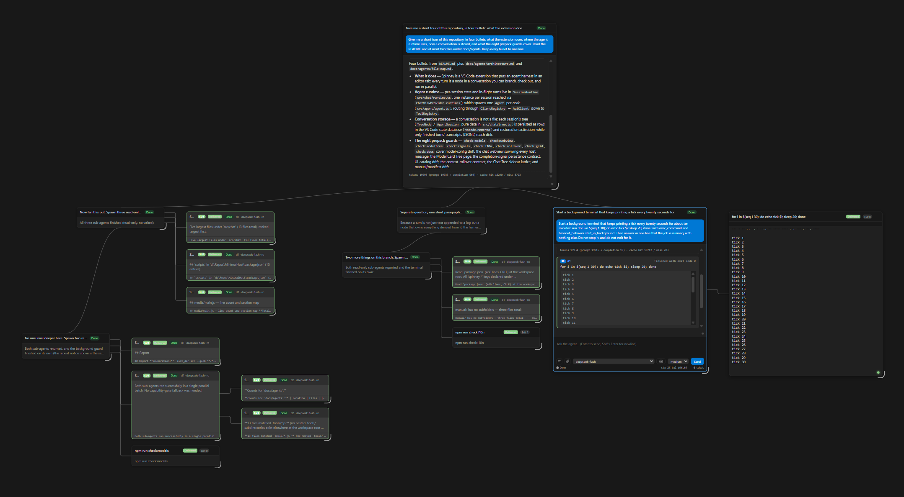
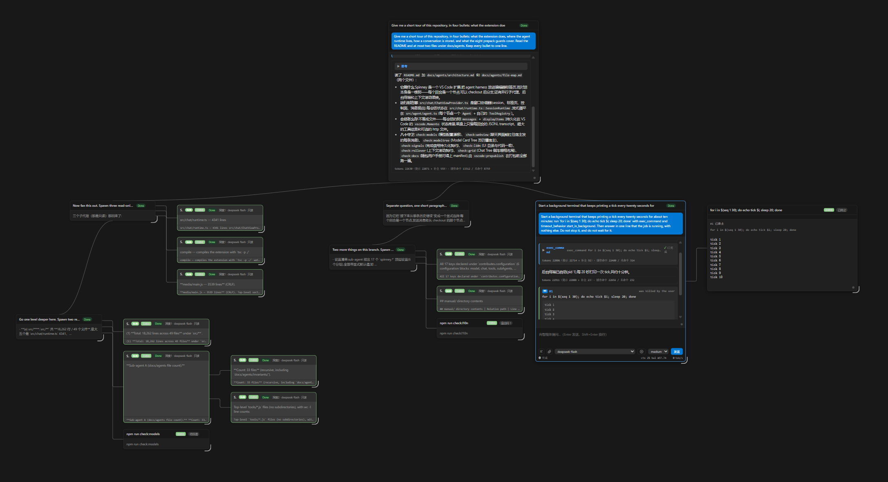

# Spinney

[中文](#spinney-zh-hans) / English

Spinney is a VS Code extension. It puts an agent harness in an editor tab, and the conversation is a tree.



## Install

Install Spinney from the [Visual Studio Marketplace](https://marketplace.visualstudio.com/items?itemName=DE-YU.spinney).

Spinney works with a folder open and with no folder open. With no folder, a relative path resolves against a scratch folder in the extension storage.

## Start

1. Run **`Spinney: Set API Key`** and paste a key. Spinney keeps it in VS Code secret storage, never in `settings.json`. The built-in provider also accepts the `DEEPSEEK_API_KEY` environment variable.
2. Open the **Spinney** container in the Activity Bar, then click **New Session**.
3. Write your message in the composer. `Enter` sends, `Shift+Enter` adds a line.

## Features

- The conversation is a history you can branch: every turn is a node. Click a turn to check it out, then send a message to branch from it.
- The old line stays in the tree, dimmed, so an earlier turn is one click away.
- The agent edits the working tree, runs shell commands, and can hold a long command in a background terminal while the turn continues.
- Sub-agents run as parallel branches and report back to the parent that started them.
- Press Stop to end the turn at the checked-out node: it aborts the turn, kills that node's background terminals and its sub-agent subtree, and nothing continues.
- A prompt-snippet button at the left of the composer fills the input with a pre-written instruction: the shipped `Plan` / `Implement Parallel`, or your own rows from `spinney.promptSections`.
- A full context window continues in a new one instead of being compressed, from the **⧉ Continue in a new window** button on the failed card.
- An agent inspects the same history with `list_nodes`, and it can hand a task to a fresh session with `hop_session`, then take back that session's answer.

## Documentation

Run **`Spinney: Show User Manual`** from the Command Palette. It opens the full manual in an editor tab: the chat tree and its gestures, sessions and tabs, models and providers, sub-agents and background terminals, images, retries and the context rollover, the complete settings and command reference, privacy, and troubleshooting.

The manual ships in English, Simplified Chinese, and Traditional Chinese, and follows the VS Code display language. The same pages live in [`manual/`](manual/manual.md), and the English page is the source.

## Models

A profile with no configuration runs the built-in `deepseek-flash` card, which accepts image input and talks to `https://api.deepseek.com`.

Everything else is a **model card**: a row of `spinney.modelCards` bound to one endpoint from `spinney.providers`. Edit both in the **Model Cards** page, which `Spinney: Open Model Cards` opens, or with the gear beside the chat's model dropdown. The page validates a save before it writes, and it holds your edits as a draft until you press Save.

- A provider row carries its name, its base URL, a concurrency cap (`0` = no limit), and how the endpoint reports its credit (`none`, `deepseek`, `openrouter`, or `moonshot`).
- A card carries the name you pick in the chat, the wire model name sent to the provider, its context window, its own concurrency cap, whether it takes images and in which dialect their bytes travel, and the thinking levels it offers with the one a session starts on.
- Each provider's API key lives in VS Code secret storage, one entry per provider. Run `Spinney: Set API Key` or `Spinney: Clear API Key`, or set a named provider's key from its row on the page.

The manual explains every field, the per-node model rule, and the cache warning a model switch costs.

## Workspace instructions

If the workspace root holds an `AGENTS.md` file, Spinney reads it once at start and adds it to the system prompt. Reload the window after you edit that file. Run `Spinney: Show System Prompt` to read the exact prompt the model receives.

## Privacy and data

Spinney sends no telemetry. It connects only to the provider endpoints you configure. A request carries your messages, the tool results, and the images.

The conversations are not files: they are rows in the VS Code state database. What does reach disk is a finished turn's transcript (JSONL), an oversized tool result, and the optional http file. Uninstall, and the steps to delete the conversations too, are in the manual.

The local HTTP control plane is off by default. Turn it on only if you need it. It then listens on `127.0.0.1` and needs a bearer token. The `/continue` endpoint makes the agent run an instruction, so treat it as a local trust boundary.

## Roadmap

- More built-in model presets.

## Development

1. `npm install`
2. `npm run dev` — `compile` plus `sync:l10n`. The Chinese catalogs VS Code looks up are generated from the canonical ones, so a plain `npm run compile` leaves the manifest and host strings English in this window (`docs/agents/invariants/i18n.md`).
3. Press F5. This opens an Extension Development Host window.

Eight build guards run before packaging: `npm run check:models`, `npm run check:webview`, `npm run check:modeltree`, `npm run check:signals`, `npm run check:l10n`, `npm run check:rollover`, `npm run check:grid`, and `npm run check:docs`.

Dev tooling lives in `tools/`: the guards, `sync-l10n-aliases.js` (the generated l10n aliases), the acceptance driver `harness-test.mjs`, `rollover-acceptance.js` (a windowless acceptance run for the context rollover), `modeltree-acceptance.js` (a windowless acceptance run for the Model Card Tree page's host half), `gate-acceptance.js` (a windowless acceptance run for the provider/card request gate), `model-switch-acceptance.js` (a windowless acceptance run for the per-node model selection), the `hvsc` supervisor, and one migration script. A change under `tools/` needs no build and no reload; that folder is not shipped in the `.vsix`.

A change under `manual/` is different: the pages ship in the `.vsix`, so they need the compile, the package and the reload like code. See `docs/agents/user-manual.md`.

## Migrating data from an older build

An older build used a different extension id. `tools/migrate-state.mjs` moves its sessions and transcripts to the new id. It handles both spellings of that id: the Memento rows in `state.vscdb` keep the manifest case (`DE-YU.spinney`), while the folder under `globalStorage` is lowercased (`de-yu.spinney`). The script prints both halves before it writes anything. If the new build already ran, it merges into the rows that build wrote, and keeps the conversations of both. Close VS Code first: it refuses to write while a window is open. Start with a dry run. Then apply it:

```bash
node tools/migrate-state.mjs --dry-run
node tools/migrate-state.mjs --apply
```

The script moves no Secrets. Run `Spinney: Set API Key` again after the migration. It also leaves `<repo>/.agent-harness` folders alone; those hold tool output of the old build.

## License and third-party code

The license is MIT. See `LICENSE`. Third-party notices live in `THIRD_PARTY_NOTICES.md` in the repository root.

The package ships markdown-it, with linkify-it, mdurl, uc.micro, punycode.js, and entities inlined. It also ships non-layered-tidy-tree-layout. markdown-it, linkify-it, mdurl, uc.micro, punycode.js, and non-layered-tidy-tree-layout are MIT licensed; entities is BSD-2-Clause.

---

# Spinney (zh-Hans)

[English](#spinney) / 中文

Spinney 是一个 VS Code 扩展。它把智能体放进一个编辑器标签页，并把对话保存成一棵可以分支的树。



## 安装

从 [Visual Studio Marketplace](https://marketplace.visualstudio.com/items?itemName=DE-YU.spinney) 安装 **Spinney**。

打开文件夹和未打开文件夹时，Spinney 都能工作。未打开文件夹时，相对路径会解析到扩展存储中的一个临时文件夹。

## 开始

1. 运行 **`Spinney: 设置 API 密钥`** 并粘贴密钥。Spinney 把密钥保存在 VS Code 密钥存储中，绝不保存在 `settings.json` 中。内置服务商也接受 `DEEPSEEK_API_KEY` 环境变量。
2. 在 Activity Bar 中打开 **Spinney** 容器，然后点击 **新建会话**。
3. 在输入框中写下消息。`Enter` 发送，`Shift+Enter` 新起一行。

## 功能

- 对话是一段可以分支的历史：每个回合都是一个节点。点击某个回合即可检出它，然后发送一条消息，就会从它分叉。
- 原来的那条线仍留在树中（变暗显示），所以更早的回合只需一次点击就能回到。
- 智能体会编辑工作区、运行 shell 命令，并且可以把耗时较长的命令放进后台终端，同时继续当前回合。
- 子智能体作为并行分支运行，并把结果回报给启动它们的父节点。
- 按 **停止** 会在检出的节点结束该回合：它中止这个回合，终止该节点拥有的后台终端和它的子智能体子树，之后不会有任何东西继续。
- 输入框左侧的提示词片段按钮会把预写指令填入输入框：扩展自带的 `Plan` / `Implement Parallel`，或你在 `spinney.promptSections` 中自己添加的行。
- 上下文窗口用满时会延续到一个新窗口，而不是被压缩：失败的那张卡片上有 **⧉ 在新窗口中继续** 按钮。
- 智能体用 `list_nodes` 查看同一段历史，也可以用 `hop_session` 把任务交给一个全新会话，然后取回那个会话的答案。

## 文档

在命令面板中运行 **`Spinney: 显示用户手册`**。它会在编辑器标签页中打开完整手册：智能体聊天树及其手势、会话与标签页、模型与服务商、子智能体与后台终端、图像、重试与上下文延续、完整的设置与命令参考、隐私，以及故障排查。

手册随扩展一起发布，含英文、简体中文和繁体中文，并跟随 VS Code 显示语言。同样的页面位于 [`manual/`](manual/manual.zh-Hans.md)，英文页是源文。

## 模型

未做任何配置的配置档案会运行内置的 `deepseek-flash` 卡片：它接受图像输入，并连接到 `https://api.deepseek.com`。

其他一切都是**模型卡片**：`spinney.modelCards` 中的一行，绑定到 `spinney.providers` 中的一个端点。两者都可以在**模型卡片**页面中编辑，用 `Spinney: 打开模型卡片` 打开，或点击聊天模型下拉框旁的齿轮。该页面在写入之前会先校验，并把你的编辑保存为草稿，直到你按下保存。

- 服务商的一行包含名称、基础地址、并发上限（`0` 表示不限），以及该端点如何报告额度（`none`、`deepseek`、`openrouter` 或 `moonshot`）。
- 一张卡片包含你在聊天中选择的名称、发送给服务商的线上模型名、它的上下文窗口、它自己的并发上限、是否接受图像以及图像字节按哪种方言传输，还有它提供的思考级别，以及新会话起始使用的那一级。
- 每个服务商的 API 密钥都保存在 VS Code 密钥存储中，每个服务商一条记录。运行 `Spinney: 设置 API 密钥` 或 `Spinney: 清除 API 密钥`，也可以在页面中、在该服务商那一行里设置指定服务商的密钥。

手册解释了每个字段、按节点解析模型的规则，以及切换模型要付出的提示词缓存代价。

## 工作区指令

如果工作区根目录下存在 `AGENTS.md`，Spinney 会在启动时读取一次，并把它加入系统提示词。编辑该文件后请重新加载窗口。运行 `Spinney: 显示系统提示词` 可以查看模型实际收到的完整提示词。

## 隐私与数据

Spinney 不发送任何遥测。它只连接你配置的服务商端点。一个请求会携带你的消息、工具结果和图像。

对话不是文件：它们是 VS Code 状态数据库中的记录。真正会落到磁盘上的是：已完成回合的转写（JSONL）、过大的工具结果，以及可选的 http 文件。卸载的步骤，以及连对话一起删除的步骤，都在手册里。

本地 HTTP 控制面默认关闭。只在需要时打开。打开后它监听 `127.0.0.1`，并需要一个 bearer token。`/continue` 端点会让智能体执行一条指令，因此请把它视为本地信任边界。

## 路线图

- 更多内置模型预设。

## 开发

1. `npm install`
2. `npm run dev` —— `compile` 加 `sync:l10n`。VS Code 会去查找的中文目录文件是由规范目录生成的，所以单纯跑 `npm run compile` 会让本窗口里的清单和宿主字符串保持英文（`docs/agents/invariants/i18n.md`）。
3. 按 F5。这会打开一个扩展开发宿主窗口。

打包前会运行八个构建守卫：`npm run check:models`、`npm run check:webview`、`npm run check:modeltree`、`npm run check:signals`、`npm run check:l10n`、`npm run check:rollover`、`npm run check:grid` 和 `npm run check:docs`。

开发工具位于 `tools/`：这些守卫、`sync-l10n-aliases.js`（生成的 l10n 别名）、验收驱动 `harness-test.mjs`、`rollover-acceptance.js`（上下文延续的无窗口验收运行）、`modeltree-acceptance.js`（模型卡片树页面宿主侧的无窗口验收运行）、`gate-acceptance.js`（服务商/卡片请求门闸的无窗口验收运行）、`model-switch-acceptance.js`（按节点选择模型的无窗口验收运行）、`hvsc` 监督进程，以及一个迁移脚本。改动 `tools/` 不需要构建，也不需要重载；该文件夹不会打进 `.vsix`。

改动 `manual/` 则不同：这些页面会打进 `.vsix`，所以它们和代码一样需要编译、打包和重载。见 `docs/agents/user-manual.md`。

## 从旧版本迁移数据

旧版本使用了不同的扩展 id。`tools/migrate-state.mjs` 会把它的会话和转写迁移到新的 id 下。它同时处理该 id 的两种写法：`state.vscdb` 里的 Memento 记录保留清单中的大小写（`DE-YU.spinney`），而 `globalStorage` 下的文件夹是小写的（`de-yu.spinney`）。脚本在写入任何内容之前会先打印这两部分。如果新版本已经运行过，它会合并到新版本写入的记录中，并保留两者的对话。请先关闭 VS Code：有窗口打开时它拒绝写入。先做一次空跑，然后再执行：

```bash
node tools/migrate-state.mjs --dry-run
node tools/migrate-state.mjs --apply
```

脚本不会迁移任何 Secrets。迁移后请重新运行 `Spinney: 设置 API 密钥`。它也不会动 `<repo>/.agent-harness` 文件夹，那里保存的是旧版本的工具输出。

## 许可与第三方代码

许可证是 MIT。见 `LICENSE`。第三方声明位于仓库根目录的 `THIRD_PARTY_NOTICES.md`。

包内包含 markdown-it，其中内联了 linkify-it、mdurl、uc.micro、punycode.js 和 entities。包内还包含 non-layered-tidy-tree-layout。markdown-it、linkify-it、mdurl、uc.micro、punycode.js 和 non-layered-tidy-tree-layout 采用 MIT 许可；entities 采用 BSD-2-Clause 许可。
